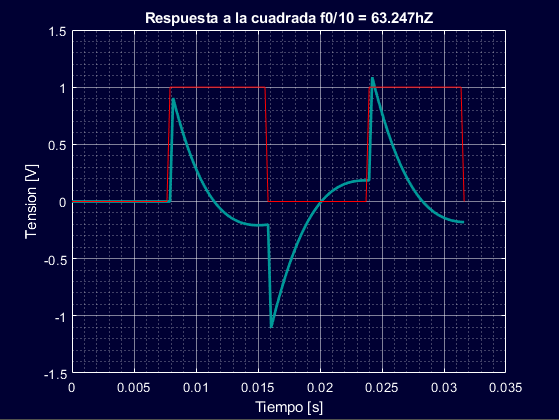
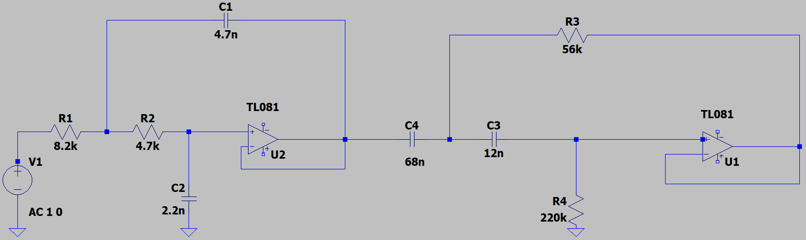

# Análisis de Circuitos con Matlab

# Objetivo del trabajo
El objetivo del trabajo consiste en el estudio de un filtro a partir de su función de transferencia y en un posterior diseño de un filtro. 

# Explicación del trabajo
El trabajo consiste de: 
  * Un informe en el cual se realizan las explicaciones de las decisiones tomadas, los resultados obtenidos y los gráficos construidos
  * Código Matlab que constata las conclusiones obtenidas y permite la obtención de gráficos
  
# Redacción de informe
Se utilizó la herramienta LaTeX para la construcción de un informe explicativo. 

# Análisis de gráficos
A lo largo del trabajo se crean gráficos con las herramientas de plotting de Matlab. En el informe se realizan análisis exhaustivos de cada uno de los gráficos y se explica el significado y las implicancias de cada uno de ellos.

# Destrezas y habilidades adquiridas
  * Comprensión del comportamiento de filtros
  * Manejo de Matlab y Octave para:
    * Realizar distintos tipos de gráficos a partir de datos importados en formatos .csv y de simulaciones
    * Realizar cálculos y obtener soluciones numéricas a los problemas planteados con el fin de compararlos con las soluciones analíticas esperadas
  * Manejo de LaTeX para redactar informes
  * Pensamiento crítico y habilidades explicativas

# Algunos gráficos analizados
### Respuesta a señal cuadrada teórica 

### Respuesta a señal cuadrada simulada

### Circuito utilizado

